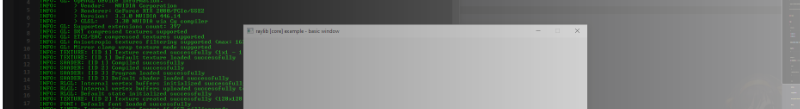
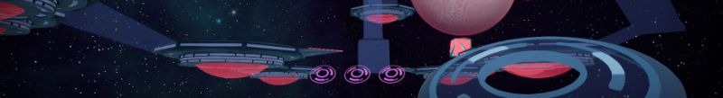
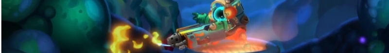

# About Terry

I've been working in **games** and **education** for almost 8 years since I
began my studies in programming. I'm currently a **Game Programming Instructor**
at the [**Academy of Interactive Entertainment**](https://seattle.aie.edu/) in Seattle, WA.

I'm happy to _work alongside with artists and designers_ on games as well as
_physicians and writers_ to translate abstract requirements into actionable
tasks for the development team.

I'm eager to continue working with teams that are excited to refine and improve
the things that they create!



## Positions

Here's a quick overview of where I've worked in the past:

📅 Date        | 🏢 Organization                           | 👔 Position                 | 🌐 Company Page
---------------|-------------------------------------------|-----------------------------|---------------------------------------------
2020 - Present | [Undisclosed Studio](#undisclosed-studio) | Principal Programmer        | N/A
2021 - Present | [AIE Seattle](#aie-seattle)               | Content Developer           | [Site](https://seattle.aie.edu)
2014 - Present | [AIE Seattle](#content-developer-role)    | Game Programming Instructor | [Site](https://seattle.aie.edu)
2016 - 2019    | [Vextar Dev Team](#vextar-dev-team)       | Lead Programmer             | [Site](https://vextar.xyz/), [itch.io](https://vextardevteam.itch.io/vextar)
2015           | [Thar Be Monsters](#thar-be-monsters)     | Build Engineer (Contract)   | [Site](https://thar-be-monsters.tumblr.com/)
2014 - 2015    | [Litesprite](#litesprite)                 | Interim Technical Director  | [Site](https://litesprite.com/), [Play Store](https://play.google.com/store/apps/details?id=com.litesprite.sinaspritepro)

I also serve on the [IGDA Seattle](https://igdaseattle.org/) Board. 💖

A list of projects I've worked on can be found on the [Projects](/projects/) page.

Otherwise, just _click on any org in the table_ ☝️ or _scroll down_ to see what I've done:

### Undisclosed Studio

I'm working part-time for an undisclosed studio as its **Principal Programmer**.
I am the _sole engineer_ for the team and work closely with artists and designers.

I also work regularly with the producer to adjust timelines and plans based on
the project's progress.

My major contributions to the project to date:

- Prototyping a **dialogue system** for Unity with integrations for animations and gameplay mechanics
  - Later, integrating [**Ink**](https://github.com/inkle/ink) with existing dialogue front-end
- Managing a **persistent 3D world** with a day/night cycle
- Designing and implementing a **quest system** with object lifecycle management
- Creating a **UI management layer** for pushing/popping UI screens and widgets
- Supporting **Bolt visual scripting** graphs with designers (or reimplementing with C#)
- **Triaging bugs** and porting fixes between releases
- Upgraded the project from Unity 2019.X to 2020.X
- Prepare **game demo for release** during _Steam Next Fest June 2022 Edition_

The game was released on Steam release in September 2022. :rocket:

### AIE Seattle

I'm a faculty member working as a **Game Programming Instructor** at [**AIE
Seattle**](https://seattle.aie.edu). I help deliver a two year course training
students to be ready to work in entry-level positions in games. Our work is
joined by the Game Art and 3D Animation; and Game Design and Production;
departments.

I also work on the **Content Development** team, resolving errors in learning
materials and writing entire subjects as necessary.

My responsibilities are as follows:

- **Delivering all course content** and **mentoring students** in their learning
  - Focus on programming fundamentals in Year 1 (C++, C#, Code Design, Data Structures, Game Math)
  - Focus on domain-specific knowledge in Year 2 (Computer Graphics, Real-Time Physics)
- Coaching students on their **career plans** and the steps needed to achieve them
- Serving as the on-site **Perforce server administrator**
  - Set up **P4 Typemap** with correct **settings for Unity and Unreal Engine projects**
  - On-boarding faculty and students to Git and Perforce version control systems with **video tutorials** and **live instruction**
  - _Cross-training_ other faculty on managing the Perforce server
  - **Troubleshooting Perforce** issues - bad workspace configuration, licensing, improper use of version control, etc.
  - Leveraged Perforce to **synchronize VFX project for remote VFX team** with on-site render-farm
  - Migrating old Perforce projects off the server and onto Git with LFS ([AIE-Seattle-Prog/p4ToGitArchive](https://github.com/AIE-Seattle-Prog/p4ToGitArchive))
- Planning and **coordinating concurrent student productions** for Year 1 and Year 2 students
- Liasoning remotely with other US campuses and leadership in Australia
- Coordinating with the AIE Marketing department to hand-off and **promote student work**

Each year, AIE Seattle faculty support students as they design, implement, and
release a number of student games from its end-of-year production projects.

A selection of recognized student production releases that I supported:

- [**DISCARDED**](https://aieseattle.itch.io/discarded) - beat down toys and ascend an abandoned world to meet the "Manic Qing"
  - Seattle Indies Expo 2021 - Official Selection
  - Dreamhack Beyond 2021 - Student Game Showcase (Top 5)
- [**The Faded Grove**](https://aieseattle.itch.io/fadedgrove) - restore a world that has lost its colors by finding and returning Chromis' lost fragments
  - Seattle Indies Expo 2020 - Official Selection
- [**Memoria Café**](https://chumpette-visual.itch.io/memoria-cafe) - delve into the depths of people's minds to learn and dispel their deepest troubles
  - Seattle Indies Expo 2019 - Official Selection
- [**Buoyancy**](https://store.steampowered.com/app/1012610/Buoyancy/) - build and protect a city on the ocean made with resources scavenged from the lost world
  - Seattle Indies Expo 2018 - Official Selection
  - Dreamhack Atlanta 2018 - Best Early Access (Indie Playground)

Other production projects can be found on [AIE Seattle's itch.io](https://aieseattle.itch.io/) page.

#### Content Developer Role

In addition to creating supplemental content, part of my week is dedicated to
prepping and developing course content for the whole institution (AIE Australia
and AIE USA).

Subjects that I have updated or written are as follows:

- Introduction to C++
- Introduction to C# for Game Programming
- Physics for Games
- Maths for Games
- Game Engine Scripting

### Vextar Dev Team

I was the **Lead Programmer** for Vextar, a first-person multiplayer "disk-on-disk"
shooter action game where players attempt to bounce each other out of the arena
with projectile disks.

It was inspired by classic arena shooters like Ricochet, Quake, Doom, as well as
Tron, of course.

My responsibilities are as follows:

- Training artists and designers on using **Unreal Engine 4**
- **Integrating C++ and Unreal Blueprints** together to support designers
- Synchronizing game state across clients in a **server-client network** model
- Exhibiting and **collecting feedback from players** who played the game at events and shows
- Prototyping new **PvP levels** and **gameplay mechanics**

The project was showcased at venues such as **PAX West** (at our alma mater's
booth), **SRGE** (Seattle's Retro Gaming Expo), and **SBDHH** (Seattle's Best Damn Happy
Hour).

<!--

Key      | Value
---------|--------------------
Website  | https://vextar.xyz/
Date     | 2016 - 2019
Position | Lead Programmer

-->

### Thar Be Monsters

I provided my services as a **Build Engineer (Contract)**, working on **Blubber
Busters**, a run-and-gun 2D action platformer that pits players into the depths
of space (or space whales).

My responsibilities are as follows:

- Integrating code from **from Git (contractors) to Perforce (core team)**
- Resolving **build blockers** for the game build every month
- Managing the **Perforce server's settings** and provisioning team members with depot access

### Litesprite

I served as the **Interim Technical Director** for its flagship project,
**Sinasprite**, a clinically-validated mental health care mobile game.

My responsibilities are as follows:

- Designing and implementing user flows in the client-facing **Unity** app
- Porting the UI from **Daikon Forge UI** to **Unity UI (uGUI)**
- Transitioning the team from **SVN to Git** and managing **releases for Android** and **iOS**
- Managing and configuring app data on the [**Google Play Store**](https://play.google.com/store/apps/details?id=com.litesprite.sinaspritepro)
- Maintaining the **MySQL database** and PHP backend for the website
- Contributed to [**US20150093733A1**](https://patents.google.com/patent/US20150093733A1/) (Patent Abandoned)
