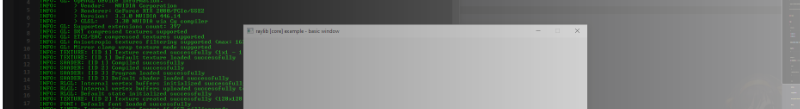

# Game Programming at AIE Seattle

I'm a faculty member working as a **Game Programming Instructor** at [**AIE
Seattle**](https://seattle.aie.edu). I help deliver a two year course training
students to be ready to work in entry-level positions in games. Our work is
joined by the Game Art and 3D Animation; and Game Design and Production
departments.

I also work on the [**Content Development**](/projects/contentDevelopmentAIE) team, resolving errors in learning
materials and writing entire subjects as necessary.

## Responsibilities

- Supporting students in AIE's very first and second release on the **Steam storefront**:
  1. [The Most Epicest Snowball Fight Ever!](https://store.steampowered.com/app/3884730/The_Most_Epicest_Snowball_Fight_Ever/)
  2. [License to Grill](https://store.steampowered.com/app/3884700/License_to_Grill/)
- Maintaining [AIE Seattle's itch.io](https://aieseattle.itch.io/) page
- **Delivering all course content** and **mentoring students** in their learning
  - Focus on programming fundamentals in Year 1 (C++, C#, Code Design, Data Structures, Game Math)
  - Focus on domain-specific knowledge in Year 2 (Computer Graphics, Real-Time Game Physics)
- Coaching students on their **career plans** and the steps needed to achieve them
- Serving as the on-site **Perforce server administrator**
  - Set up **P4 Typemap** with correct **settings for Unity and Unreal Engine projects**
  - On-boarding faculty and students to Git and Perforce version control systems with **video tutorials** and **live instruction**
  - _Cross-training_ other faculty on managing the Perforce server
  - **Troubleshooting Perforce** issues - bad workspace configuration, licensing, improper use of version control, etc.
  - Leveraged Perforce to **synchronize VFX project for remote VFX team** with on-site render-farm
  - Migrating old Perforce projects off the server and onto Git with LFS ([AIE-Seattle-Prog/p4ToGitArchive](https://github.com/AIE-Seattle-Prog/p4ToGitArchive))
- Planning and **coordinating concurrent student productions** for Year 1 and Year 2 students
- Liasoning remotely with other US campuses and leadership in Australia
- Coordinating with the AIE Marketing department to hand-off and **promote student work**

## Student Success

Each year, AIE Seattle faculty support students as they design, implement, and
release a number of student games from its end-of-year production projects.

A selection of recognized student production releases that I supported:

- [**DISCARDED**](https://aieseattle.itch.io/discarded) - beat down toys and ascend an abandoned world to meet the "Manic Qing"
  - Seattle Indies Expo 2021 - Official Selection
  - Dreamhack Beyond 2021 - Student Game Showcase (Top 5)
- [**The Faded Grove**](https://aieseattle.itch.io/fadedgrove) - restore a world that has lost its colors by finding and returning Chromis' lost fragments
  - Seattle Indies Expo 2020 - Official Selection
- [**Memoria Café**](https://chumpette-visual.itch.io/memoria-cafe) - delve into the depths of people's minds to learn and dispel their deepest troubles
  - Seattle Indies Expo 2019 - Official Selection
- [**Buoyancy**](https://store.steampowered.com/app/1012610/Buoyancy/) - build and protect a city on the ocean made with resources scavenged from the lost world
  - Seattle Indies Expo 2018 - Official Selection
  - Dreamhack Atlanta 2018 - Best Early Access (Indie Playground)

Other production projects can be found on [AIE Seattle's itch.io](https://aieseattle.itch.io/) page.