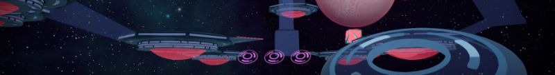

# Vextar

I was the **Lead Programmer** for Vextar, a first-person multiplayer
"disk-on-disk" shooter action game where players attempt to bounce each other
out of the arena with projectile disks.

It was inspired by classic arena shooters like Ricochet, Quake, Doom, as well as
Tron, of course.

My responsibilities were as follows:

- Training artists and designers on using **Unreal Engine 4**
- **Integrating C++ and Unreal Blueprints** together to support designers
- Synchronizing game state across clients in a **server-client network** model
- Exhibiting and **collecting feedback from players** who played the game at events and shows
- Prototyping new **PvP levels** and **gameplay mechanics**

The project was showcased at venues such as **PAX West** (at our alma mater's
booth), **SRGE** (Seattle's Retro Gaming Expo), and **SBDHH** (Seattle's Best
Damn Happy Hour).